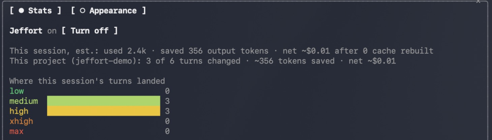
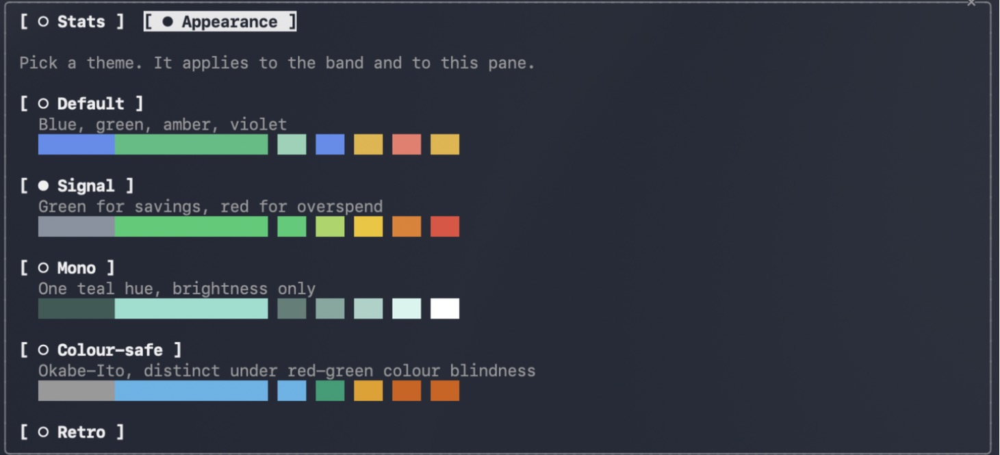
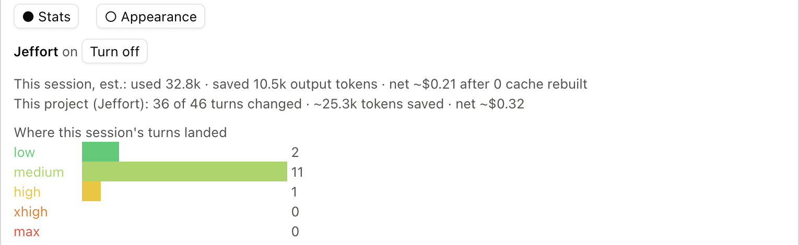
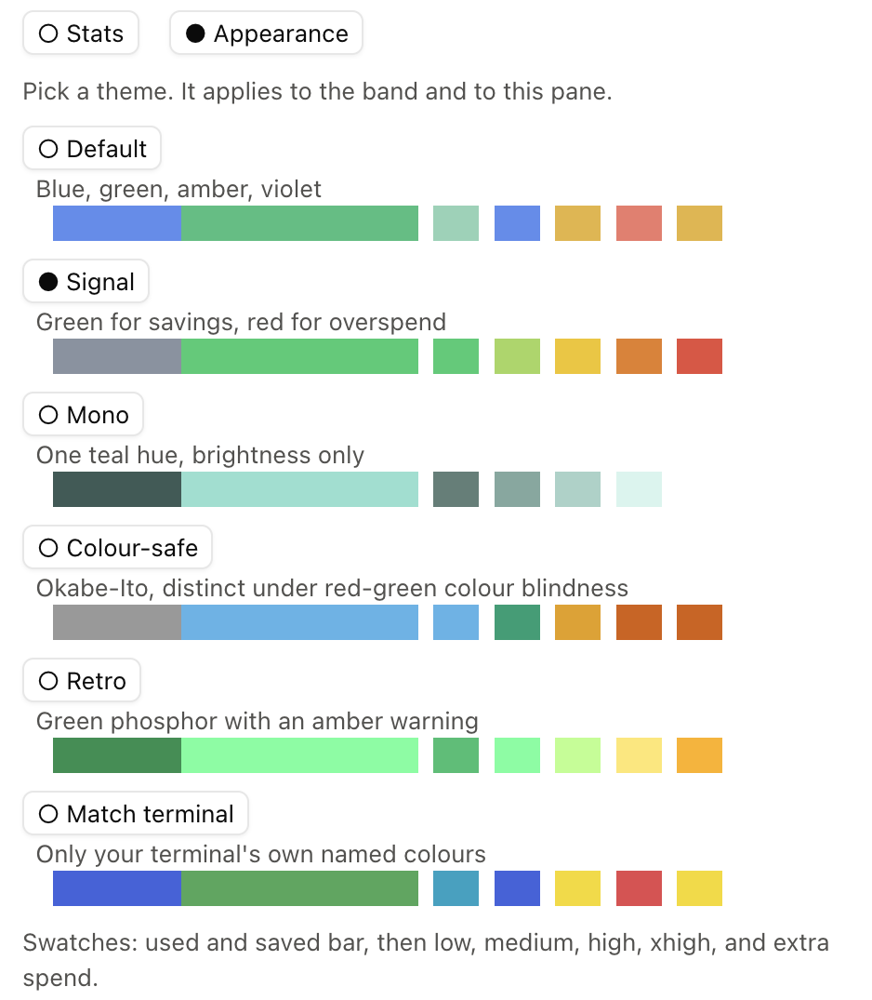
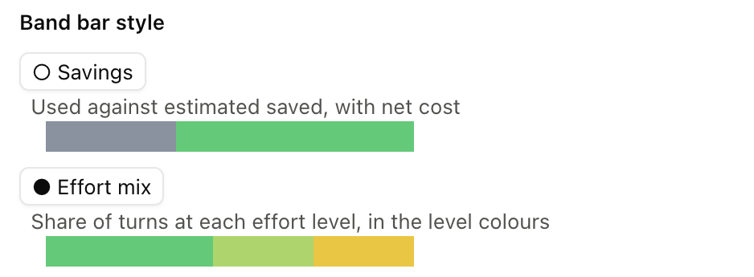

# Jeffort

A Claude Code mod that sets Claude's effort level for each turn, automatically. [TypeSafe Jev](https://docs.typesafe.ai) scores your prompt on four narrow questions (reasoning depth, scope, stakes, ambiguity), and Jeffort maps the result onto an effort level. The model is never touched.

## Why I built it

I don't want to micromanage effort. On the newest models, changing it mid-session no longer throws away the prompt cache, but that only made switching cheap. It didn't make it something I want to keep doing by hand. Claude Code should adjust effort on its own, the way auto mode handles permissions.

Getting it wrong costs either way:

- **Too high** and you burn tokens on turns that didn't need them.
- **Too low** and the result can be below par, or need redoing, which costs more tokens than getting it right the first time.

Jeffort picks the level per turn, aiming for the best result and saving money where a turn doesn't need much. A Jev call costs very little next to the output tokens it can save.

If you normally run complex projects on medium, expect Jeffort to pick higher levels quite often. That isn't Jeffort overspending: it's the effort those turns needed, which a fixed medium was quietly under-serving.

I hope and expect Anthropic to ship auto-effort at some point, and I also hope auto-model follows. Jeffort leaves the model alone because switching models mid-session still rebuilds the whole cache.

## What you see

The band, one row above the prompt, shows the **Jeffort** button, the level change, a short bar, and this session's tokens saved or spent extra. A drop reads Jeffort's level first, a boost reads yours first with Jeffort's in bold, in the theme's colour for max (red in Signal):

```
[ Jeffort ] medium ← high  ███████░░░  ~10.5k saved
[ Jeffort ] medium → xhigh ██████▒▒▒▒  ~4.2k extra
```

The bar shows tokens used against saved, or, with the Effort mix style, the share of turns at each level. All plugins share this band: Jeffort draws its row above whatever other plugins put there, and steps aside while Claude Code shows a feedback survey (answer or dismiss it with `0`).

Outside the pane everything is in output tokens; dollar estimates and the detail live in the pane. Jeffort's status line under the prompt is used only for warnings, such as a missing key, and clears once a turn scores.

### Audit only

Not ready to let Jeffort change anything? `/jeffort audit`, or **Audit only** in the pane, scores every turn and records what Jeffort would have picked, while your own effort runs untouched. The band then reads `audit · medium → would pick xhigh`, and its bar shows what you ran against what Jeffort's picks would have saved or spent. Audit totals are kept apart from the live ones, for the session, the project and all projects, so you can compare before switching on.

It is also a cheap way to see how your effort is spread: the Effort mix style shows where Jeffort would have put each turn.

Click **Jeffort** for the pane: the On, Audit only and Off controls, this session's, this project's and all projects' totals with dollar estimates, and where this session's turns landed. It also lists the last few turns with the level Jeffort picked over your own:



The **Appearance** tab picks a theme and the band's bar style:



### In the Claude desktop app

The same band and pane work in the Code tab, where the pane docks beside the transcript:







## Install

```sh
claude plugin marketplace add andrewstephenson-v1/Jeffort
claude plugin install jeffort@jeffort --scope user
```

To try a local clone for one session instead: `claude --plugin-dir /path/to/Jeffort`.

## Where the key goes

Jeffort needs a [TypeSafe](https://docs.typesafe.ai) API key. Put it in a file in your home folder:

```sh
mkdir -p ~/.config/jeffort
printf 'TYPESAFE_API_KEY=your-key\nTYPESAFE_MODEL=jev-latest\n' > ~/.config/jeffort/.env
```

Jeffort looks in these places, in order, and takes the first value it finds for each variable:

1. Process variables (`TYPESAFE_API_KEY`, `TYPESAFE_MODEL`).
2. `.env` or `jeffort.env` in the plugin's own folder.
3. `.env` or `jeffort.env` in `~/.config/jeffort/`.

Three things that catch people out:

- **Your project's `.env` is not read.** Jeffort never opens files in the project you are working on, because they often hold unrelated secrets. Copy just the TypeSafe lines across: `grep '^TYPESAFE_' /path/to/project/.env > ~/.config/jeffort/.env`.
- **A `.env` beside the plugin only helps with `--plugin-dir`.** An installed copy runs from Claude Code's plugin cache, which is not your clone, so a gitignored `.env` in the repo is not there. Use the home-folder file.
- **If Claude Code's permission rules block reading `.env` files** (for example a `Read(**/.env)` deny rule), name the file `jeffort.env` instead. This is untested on a machine with such a rule, so tell me if it does not help.

If a turn shows `Jeffort: no TYPESAFE_API_KEY found`, none of those places had a key. Check with `grep -c '^TYPESAFE_API_KEY=.' ~/.config/jeffort/.env`, which should print 1. Jeffort rereads the files on each turn until it finds a key, so a fix applies on your next prompt with no reload.

`TYPESAFE_MODEL` is optional and defaults to `jev-latest`. Prompts are sent to TypeSafe for scoring, with the name of the Claude model that will answer (so Jev can judge how much effort that model needs), and nothing else is.

## Usage

- `/jeffort` toggles it on and off. `/jeffort on`, `audit`, `off` and `pane` also work. The band has no on/off button: click **Jeffort** and use the pane's On, Audit only and Off.
- `/jeffort reset` clears this session's and this project's totals, live and audit; `/jeffort reset all` clears every project and the overall totals.
- Totals are kept for this session, this project and all projects. A project is the session's project root, keyed by its full path, so two folders with the same name stay separate. A git worktree counts as its own project.
- **Appearance** tab: Default, Signal, Mono, Colour-safe, Retro, or Match terminal.
- Settings (`/config`): the lowest and highest level Jeffort may pick (`max` is off by default), and whether it sets effort for subagents too (on by default).

## When it acts

Jeffort only rewrites effort where Claude Code keeps the prompt cache across effort changes. On every other model, each effort level has its own cache, so a change would rebuild the whole conversation.

| Model | Keeps the cache from Claude Code | Released | Note |
|---|---|---|---|
| Fable 5.1 | 2.1.260 | 2026-09-03 | Earlier versions rebuilt the cache on every effort change |
| Opus 5.5 | 2.1.280 | 2026-09-22 | First release with the model |
| Sonnet 5.5 | 2.1.284 | 2026-09-28 | First release with the model |

That only holds with an Anthropic API key or a Claude subscription. It does not hold on Bedrock, Google Cloud's Agent Platform, a Claude apps gateway, with `CLAUDE_CODE_DISABLE_EXPERIMENTAL_BETAS` set, or under an organization HIPAA configuration. Source: [Claude Code docs, "Changing effort level"](https://code.claude.com/docs/en/prompt-caching#changing-effort-level).

Audit mode changes nothing, so it runs on any model and provider where the session has an effort level, including Bedrock, Vertex and older models.

Jeffort currently needs Claude Code 2.1.284 or later for all three models. It detects Bedrock, Vertex and gateways and does nothing there, but it cannot yet detect `CLAUDE_CODE_DISABLE_EXPERIMENTAL_BETAS` or a HIPAA configuration, so turn it off in those setups.

It also leaves these alone, so your own `/effort` stands:

- Turns where Jev's confidence is below 0.3.
- Turns where Jev cannot be reached or errors.

A turn with no prompt of yours, such as a continuation or a subagent reporting back, is not sent to Jev. It keeps the previous turn's level, or the session's effort if there is none yet.

Measured on Opus 5.5: the first effort change in a conversation rebuilds about 22k tokens of cache, once. Later changes keep it. That one-time cost is subtracted from the savings the band shows. Jeffort spots it as a large cache write on the first request of a turn whose level changed, so it is an estimate too: a compaction on such a turn can look the same.

## Subagents

Each subagent is scored once, on the task it was given, and keeps that level for its whole run. Its turns count toward the totals. It never counts as a cache rebuild, because a subagent starts a fresh conversation. A subagent on a model not listed above (Haiku, say) is left alone.

Jeffort only changes a subagent that inherited the session's effort. It cannot read an agent's definition, so it treats an effort other than the session's as one the definition set, and leaves it. The gap: an agent whose definition sets the same level as your session looks inherited and gets scored. Forks and teammates carry on the parent's conversation, so they are left alone too.

Turn it off with the **Subagents too** setting in `/config`.

## What the savings numbers are

Estimates. They assume fixed output-token ratios per effort level, relative to high: low 0.55, medium 0.75, high 1.0, xhigh 1.7, max 2.2. Low and xhigh are rounded from the coding benchmark in `bench/` (0.58 and 1.80). Medium is interpolated and max is a guess: neither was measured. Dollar figures cover Opus 5.5 and Sonnet 5.5 only.

Audit estimates run the same ratios the other way: the tokens were measured at your effort, and the estimate is what Jeffort's pick would have produced. They leave out the one-time cache rebuild that switching on would cost (see When it acts).

## Benchmarks

`bench/` holds two benchmarks, each comparing fixed effort levels against Jeffort on Opus 5.5:

- `bench/run.py`: ten short questions.
- `bench/agentic/run.py`: eight coding tasks with file and shell tools, graded by tests.

`bench/jev_picks.py` is a survey rather than a benchmark: it records what Jeffort picks for 26 prompts, coding and not.

On the coding tasks Jeffort used about half the output tokens of xhigh, and every task passed. Every task also passed at low, so those tasks cannot show a quality loss from lower effort. One sample per cell.

## Develop

```sh
claude plugin validate .
claude plugin test .
```

## Layout

- `hooks/register.tsx`: the hooks module (scoring, band, pane)
- `hooks/policy.ts`: Jev questions, level mapping, themes, savings maths (no engine calls)
- `types/index.d.ts`: state contract
- `tests/`: `claude plugin test` suite
- `docs/ui-options.html`: the UI options explored

## License

MIT
